<div id="contours-section-cartes" class="contours-section-sketch"></div>

<script type="module">
  import { renderContoursSectionBanner } from "../assets/js/contours-sketch.js";

  renderContoursSectionBanner("#contours-section-cartes", {
    sectionTitle: "Cartes et visualisations"
  }).catch((error) => {
    console.error("[contours-section] La banniere n'a pas pu etre affichee.", error);
  });
</script>

<section class="gallery-intro">
  <p class="gallery-lede">Une galerie des cartes, graphiques, animations et simulations publiés sur <span class="contours-word">contours.nc</span>.</p>
  <p>Chaque carte ouvre d'abord la visualisation elle-même, ou son export public le plus lisible. Les articles associés restent accessibles en contexte pour retrouver l'analyse, les sources et les choix de méthode.</p>
</section>

```{=html}
<section class="viz-gallery-grid" aria-label="Galerie cartes et visualisations">
  <article class="viz-gallery-card">
    <a class="viz-gallery-card__image" href="../posts/pacific-climate-fingerprints/">
      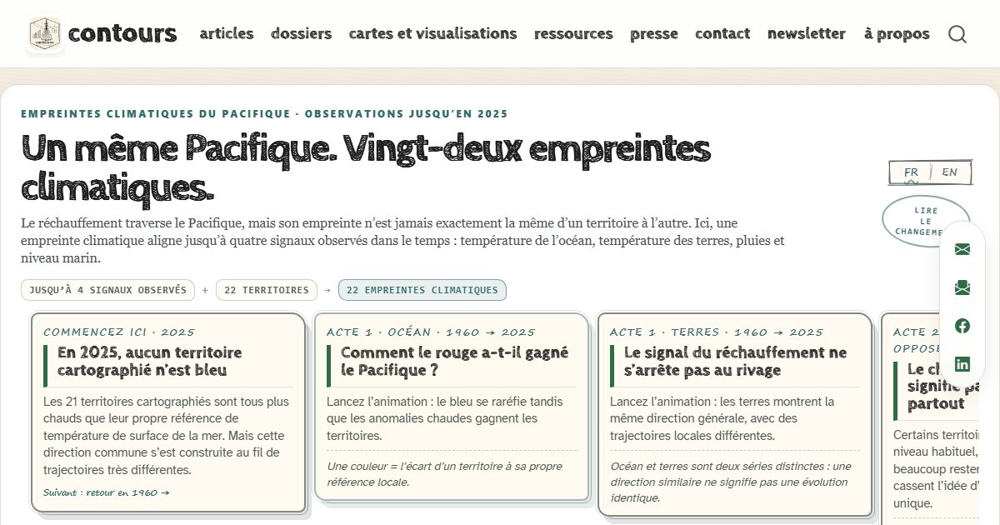
    </a>
    <div class="viz-gallery-card__body">
      <span class="viz-gallery-card__meta">Pacifique · dataviz interactive</span>
      <h3><a href="../posts/pacific-climate-fingerprints/">Empreintes climatiques du Pacifique</a></h3>
      <p>Océan, terres, pluies et niveau marin : comparez les signaux observés, puis révélez la trajectoire propre à chacun des 22 territoires.</p>
      <div class="viz-gallery-card__tags">
        <span class="viz-gallery-tag">carte interactive</span>
        <span class="viz-gallery-tag">changement climatique</span>
        <span class="viz-gallery-tag">Pacifique</span>
      </div>
      <div class="viz-gallery-card__actions">
        <a class="viz-gallery-card__link" href="../posts/pacific-climate-fingerprints/">Explorer la dataviz</a>
        <a class="viz-gallery-card__secondary" href="https://pacificdatavizchallenge.org/fr" target="_blank" rel="noopener noreferrer">Voir le challenge</a>
      </div>
    </div>
  </article>

  <article class="viz-gallery-card">
    <a class="viz-gallery-card__image" href="../posts/disparites-territoriales-nouvelle-caledonie/">
      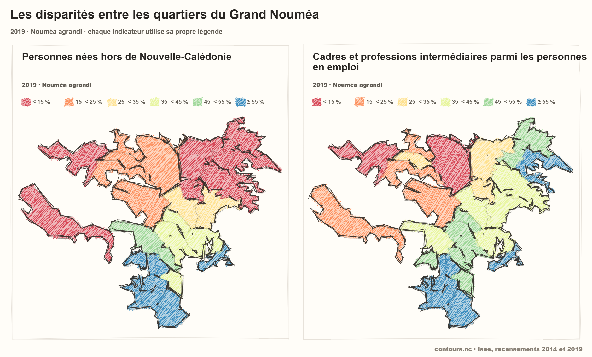
    </a>
    <div class="viz-gallery-card__body">
      <span class="viz-gallery-card__meta">Grand Nouméa · explorateurs interactifs</span>
      <h3><a href="../posts/disparites-territoriales-nouvelle-caledonie/">Explorer les disparités territoriales en Nouvelle-Calédonie</a></h3>
      <p>Onze indicateurs à cartographier, croiser dans un nuage de points et comparer dans une matrice multivariée des quartiers.</p>
      <div class="viz-gallery-card__tags">
        <span class="viz-gallery-tag">carte interactive</span>
        <span class="viz-gallery-tag">corrélations</span>
        <span class="viz-gallery-tag">matrice</span>
      </div>
      <div class="viz-gallery-card__actions">
        <a class="viz-gallery-card__link" href="../posts/disparites-territoriales-nouvelle-caledonie/#carte-nc">Ouvrir la carte NC</a>
        <a class="viz-gallery-card__secondary" href="../posts/disparites-territoriales-nouvelle-caledonie/#correlations-nc">Croiser les variables</a>
        <a class="viz-gallery-card__secondary" href="../posts/disparites-territoriales-nouvelle-caledonie/#matrice">Ouvrir la matrice</a>
      </div>
    </div>
  </article>

  <article class="viz-gallery-card">
    <a class="viz-gallery-card__image" href="../posts/concentration-population-noumea-pacifique/#carte-population-communes">
      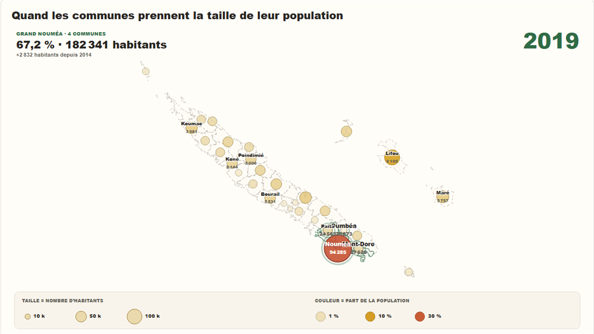
    </a>
    <div class="viz-gallery-card__body">
      <span class="viz-gallery-card__meta">Nouvelle-Calédonie · carte animée</span>
      <h3><a href="../posts/concentration-population-noumea-pacifique/#carte-population-communes">Population par commune depuis 1956</a></h3>
      <p>Un cartogramme animé où la taille des cercles montre le nombre d’habitants et la couleur la part de chaque commune dans la population totale.</p>
      <div class="viz-gallery-card__tags">
        <span class="viz-gallery-tag">carte animée</span>
        <span class="viz-gallery-tag">démographie</span>
      </div>
      <div class="viz-gallery-card__actions">
        <a class="viz-gallery-card__link" href="../posts/concentration-population-noumea-pacifique/#carte-population-communes">Ouvrir la carte</a>
        <a class="viz-gallery-card__secondary" href="../posts/concentration-population-noumea-pacifique/">Lire l’article</a>
      </div>
    </div>
  </article>

  <article class="viz-gallery-card">
    <a class="viz-gallery-card__image" href="../images/previews/chart-voix-nuances-congres-contours-nc.png">
      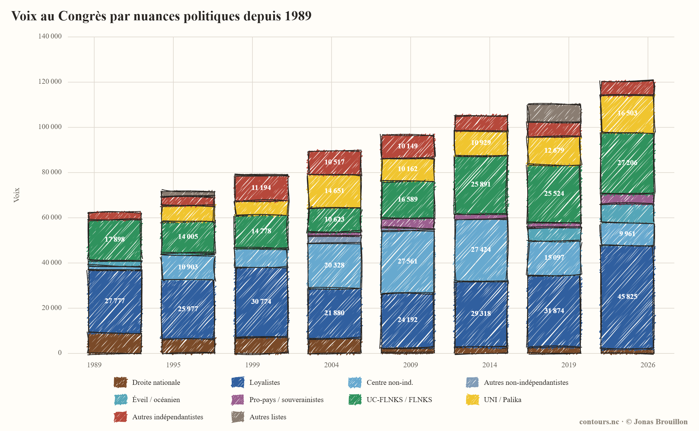
    </a>
    <div class="viz-gallery-card__body">
      <span class="viz-gallery-card__meta">Nouvelle-Calédonie · graphique</span>
      <h3><a href="../images/previews/chart-voix-nuances-congres-contours-nc.png">Voix au Congrès par nuances politiques</a></h3>
      <p>Une lecture longue des rapports de force au Congrès, en distinguant les nuances internes aux grandes familles.</p>
      <div class="viz-gallery-card__tags">
        <span class="viz-gallery-tag">graphique</span>
        <span class="viz-gallery-tag">Congrès</span>
      </div>
      <div class="viz-gallery-card__actions">
        <a class="viz-gallery-card__link" href="../images/previews/chart-voix-nuances-congres-contours-nc.png">Ouvrir la visualisation</a>
        <a class="viz-gallery-card__secondary" href="../posts/provinciales-2026-premier-bilan/">Lire l'analyse</a>
      </div>
    </div>
  </article>

  <article class="viz-gallery-card">
    <a class="viz-gallery-card__image" href="../images/previews/provinciales-2026-congres-proportionnelle-nc.png">
      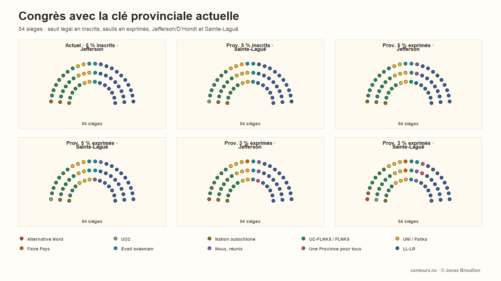
    </a>
    <div class="viz-gallery-card__body">
      <span class="viz-gallery-card__meta">Nouvelle-Calédonie · simulation</span>
      <h3><a href="../images/previews/provinciales-2026-congres-proportionnelle-nc.png">Simulations de sièges au Congrès</a></h3>
      <p>Comparaison visuelle des effets de seuils, de clés provinciales et de méthodes de répartition.</p>
      <div class="viz-gallery-card__tags">
        <span class="viz-gallery-tag">simulation</span>
        <span class="viz-gallery-tag">hémicycle</span>
      </div>
      <div class="viz-gallery-card__actions">
        <a class="viz-gallery-card__link" href="../images/previews/provinciales-2026-congres-proportionnelle-nc.png">Ouvrir la visualisation</a>
        <a class="viz-gallery-card__secondary" href="../posts/provinciales-2026-congres-proportionnelle-nc/">Lire la méthode</a>
      </div>
    </div>
  </article>

  <article class="viz-gallery-card">
    <a class="viz-gallery-card__image" href="../images/previews/gouverner-ensemble-coalitions.png">
      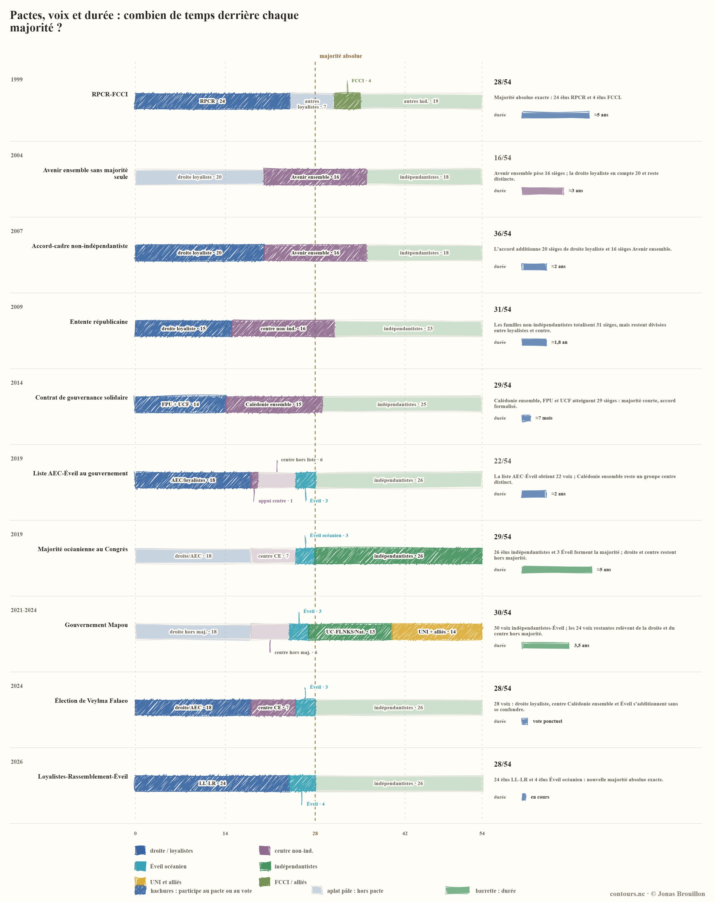
    </a>
    <div class="viz-gallery-card__body">
      <span class="viz-gallery-card__meta">Nouvelle-Calédonie · chronologie</span>
      <h3><a href="../images/previews/gouverner-ensemble-coalitions.png">Pactes de gouvernance calédoniens</a></h3>
      <p>Une chronologie des alliances, pactes et accords de gouvernance depuis la fin des années 1990.</p>
      <div class="viz-gallery-card__tags">
        <span class="viz-gallery-tag">graphique</span>
        <span class="viz-gallery-tag">institutions</span>
      </div>
      <div class="viz-gallery-card__actions">
        <a class="viz-gallery-card__link" href="../images/previews/gouverner-ensemble-coalitions.png">Ouvrir la visualisation</a>
        <a class="viz-gallery-card__secondary" href="../posts/gouverner-ensemble-jusque-quand/">Lire l'article</a>
      </div>
    </div>
  </article>

  <article class="viz-gallery-card">
    <a class="viz-gallery-card__image" href="../images/previews/provinciales-2026-troisieme-voie-positionnement.webp">
      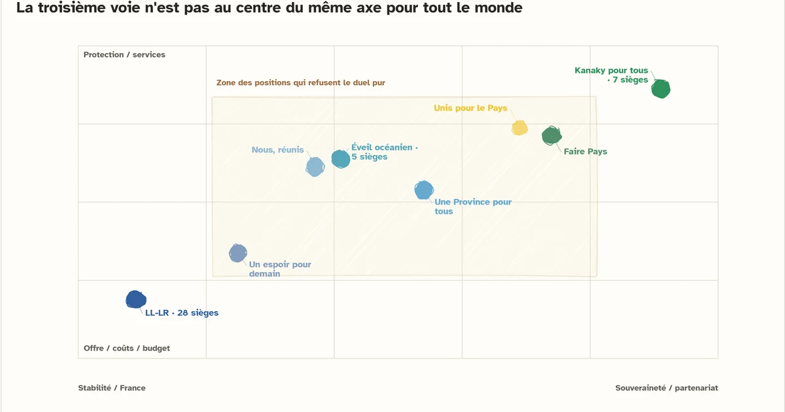
    </a>
    <div class="viz-gallery-card__body">
      <span class="viz-gallery-card__meta">Province Sud · graphique</span>
      <h3><a href="../images/previews/provinciales-2026-troisieme-voie-positionnement.webp">Positionnement de la troisième voie</a></h3>
      <p>Un espace de positionnement programmatique pour situer les listes en dehors du face-à-face principal.</p>
      <div class="viz-gallery-card__tags">
        <span class="viz-gallery-tag">graphique</span>
        <span class="viz-gallery-tag">analyse textuelle</span>
      </div>
      <div class="viz-gallery-card__actions">
        <a class="viz-gallery-card__link" href="../images/previews/provinciales-2026-troisieme-voie-positionnement.webp">Ouvrir la visualisation</a>
        <a class="viz-gallery-card__secondary" href="../posts/provinciales-2026-troisieme-voie/">Lire l'analyse</a>
      </div>
    </div>
  </article>

  <article class="viz-gallery-card">
    <a class="viz-gallery-card__image" href="../images/previews/provinciales-2026-flux-sud.jpg">
      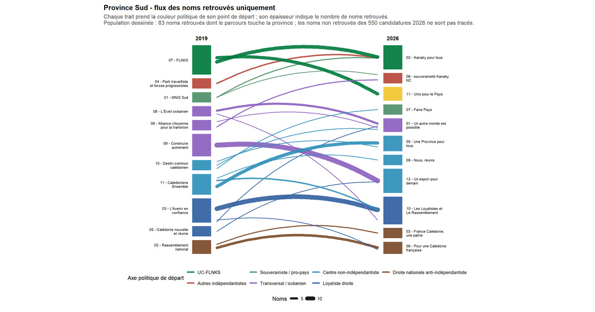
    </a>
    <div class="viz-gallery-card__body">
      <span class="viz-gallery-card__meta">Province Sud · graphique</span>
      <h3><a href="../images/previews/provinciales-2026-flux-sud.jpg">Flux de candidatures 2019-2026</a></h3>
      <p>Une visualisation des continuités, retours, déplacements et recompositions de listes.</p>
      <div class="viz-gallery-card__tags">
        <span class="viz-gallery-tag">graphique</span>
        <span class="viz-gallery-tag">candidatures</span>
      </div>
      <div class="viz-gallery-card__actions">
        <a class="viz-gallery-card__link" href="../images/previews/provinciales-2026-flux-sud.jpg">Ouvrir la visualisation</a>
        <a class="viz-gallery-card__secondary" href="../posts/provinciales-2026-qui-part-qui-reste/">Lire l'article</a>
      </div>
    </div>
  </article>

  <article class="viz-gallery-card">
    <a class="viz-gallery-card__image" href="../images/previews/provinciales-2026-renouvellement-elus.png">
      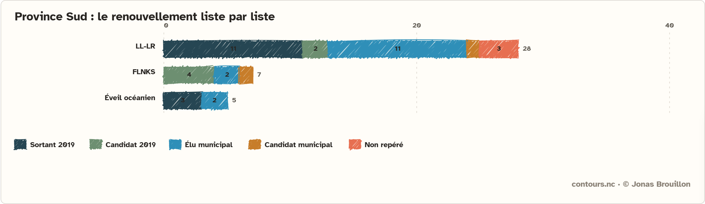
    </a>
    <div class="viz-gallery-card__body">
      <span class="viz-gallery-card__meta">Provinces · graphique</span>
      <h3><a href="../images/previews/provinciales-2026-renouvellement-elus.png">Origine des élus provinciaux 2026</a></h3>
      <p>Sortants, nouveaux élus, élus municipaux et candidats déjà repérés dans une lecture par liste.</p>
      <div class="viz-gallery-card__tags">
        <span class="viz-gallery-tag">graphique</span>
        <span class="viz-gallery-tag">renouvellement</span>
      </div>
      <div class="viz-gallery-card__actions">
        <a class="viz-gallery-card__link" href="../images/previews/provinciales-2026-renouvellement-elus.png">Ouvrir la visualisation</a>
        <a class="viz-gallery-card__secondary" href="../posts/provinciales-2026-renouvellement-elus/">Lire l'article</a>
      </div>
    </div>
  </article>

  <article class="viz-gallery-card">
    <a class="viz-gallery-card__image" href="../images/previews/provinciales-2026-professions-foi.webp">
      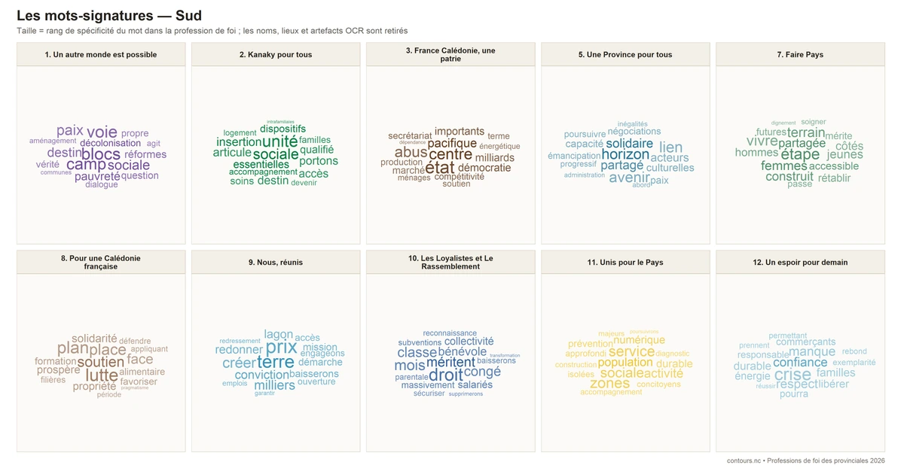
    </a>
    <div class="viz-gallery-card__body">
      <span class="viz-gallery-card__meta">Provinces · graphique</span>
      <h3><a href="../images/previews/provinciales-2026-professions-foi.webp">Mots-signatures des professions de foi</a></h3>
      <p>Nuages de mots et portraits thématiques pour comparer les registres programmatiques.</p>
      <div class="viz-gallery-card__tags">
        <span class="viz-gallery-tag">graphique</span>
        <span class="viz-gallery-tag">analyse textuelle</span>
      </div>
      <div class="viz-gallery-card__actions">
        <a class="viz-gallery-card__link" href="../images/previews/provinciales-2026-professions-foi.webp">Ouvrir la visualisation</a>
        <a class="viz-gallery-card__secondary" href="../posts/provinciales-2026-professions-foi/">Lire l'article</a>
      </div>
    </div>
  </article>

  <article class="viz-gallery-card">
    <a class="viz-gallery-card__image" href="participation-municipales-animation.html">
      
    </a>
    <div class="viz-gallery-card__body">
      <span class="viz-gallery-card__meta">Nouméa · animation</span>
      <h3><a href="participation-municipales-animation.html">Participation municipale 2020-2026</a></h3>
      <p>Animation cartographique comparant les niveaux de participation à l'échelle des bureaux de vote.</p>
      <div class="viz-gallery-card__tags">
        <span class="viz-gallery-tag">animation</span>
        <span class="viz-gallery-tag">participation</span>
      </div>
      <div class="viz-gallery-card__actions">
        <a class="viz-gallery-card__link" href="participation-municipales-animation.html">Ouvrir la visualisation</a>
        <a class="viz-gallery-card__secondary" href="../posts/participation-accessibilite-bureaux-noumea/">Lire l'article</a>
      </div>
    </div>
  </article>

  <article class="viz-gallery-card">
    <a class="viz-gallery-card__image" href="../data/cartes/municipales%202026/municipales_2026_moins_2020_t1_noumea_ecart_participation.webp">
      
    </a>
    <div class="viz-gallery-card__body">
      <span class="viz-gallery-card__meta">Nouméa · carte statique</span>
      <h3><a href="../data/cartes/municipales%202026/municipales_2026_moins_2020_t1_noumea_ecart_participation.webp">Écarts de participation à Nouméa</a></h3>
      <p>Carte des quartiers où la participation municipale évolue le plus entre 2020 et 2026.</p>
      <div class="viz-gallery-card__tags">
        <span class="viz-gallery-tag">carte statique</span>
        <span class="viz-gallery-tag">participation</span>
      </div>
      <div class="viz-gallery-card__actions">
        <a class="viz-gallery-card__link" href="../data/cartes/municipales%202026/municipales_2026_moins_2020_t1_noumea_ecart_participation.webp">Ouvrir la carte</a>
        <a class="viz-gallery-card__secondary" href="../posts/participation-accessibilite-bureaux-noumea/">Lire l'article</a>
      </div>
    </div>
  </article>

  <article class="viz-gallery-card">
    <a class="viz-gallery-card__image" href="temps-trajet-bureaux-animation.html">
      
    </a>
    <div class="viz-gallery-card__body">
      <span class="viz-gallery-card__meta">Nouméa · animation</span>
      <h3><a href="temps-trajet-bureaux-animation.html">Temps d'accès aux bureaux de vote</a></h3>
      <p>Animation des temps de marche selon différentes configurations de bureaux et centres de vote.</p>
      <div class="viz-gallery-card__tags">
        <span class="viz-gallery-tag">animation</span>
        <span class="viz-gallery-tag">accessibilité</span>
      </div>
      <div class="viz-gallery-card__actions">
        <a class="viz-gallery-card__link" href="temps-trajet-bureaux-animation.html">Ouvrir la visualisation</a>
        <a class="viz-gallery-card__secondary" href="../posts/regroupement-bureaux-vote-noumea/">Lire la méthode</a>
      </div>
    </div>
  </article>

  <article class="viz-gallery-card">
    <a class="viz-gallery-card__image" href="../data/cartes/municipales%202026/temps%20trajet%20noum%C3%A9a%20bureaux%20regroup%C3%A9s.webp">
      
    </a>
    <div class="viz-gallery-card__body">
      <span class="viz-gallery-card__meta">Nouméa · analyse spatiale</span>
      <h3><a href="../data/cartes/municipales%202026/temps%20trajet%20noum%C3%A9a%20bureaux%20regroup%C3%A9s.webp">Accessibilité des bureaux regroupés</a></h3>
      <p>Carte des temps de marche vers les bureaux après regroupement, au plus près des quartiers concernés.</p>
      <div class="viz-gallery-card__tags">
        <span class="viz-gallery-tag">analyse spatiale</span>
        <span class="viz-gallery-tag">carte statique</span>
      </div>
      <div class="viz-gallery-card__actions">
        <a class="viz-gallery-card__link" href="../data/cartes/municipales%202026/temps%20trajet%20noum%C3%A9a%20bureaux%20regroup%C3%A9s.webp">Ouvrir la carte</a>
        <a class="viz-gallery-card__secondary" href="../posts/regroupement-bureaux-vote-noumea/">Lire la méthode</a>
      </div>
    </div>
  </article>

  <article class="viz-gallery-card">
    <a class="viz-gallery-card__image" href="../data/cartes/capital%20socio-economique/capital_acp_lisse_nc.webp">
      
    </a>
    <div class="viz-gallery-card__body">
      <span class="viz-gallery-card__meta">Nouvelle-Calédonie · analyse spatiale</span>
      <h3><a href="../data/cartes/capital%20socio-economique/capital_acp_lisse_nc.webp">Capital socio-économique en Nouvelle-Calédonie</a></h3>
      <p>Carte lissée d'un indice synthétique construit à partir des données du RGP 2019.</p>
      <div class="viz-gallery-card__tags">
        <span class="viz-gallery-tag">analyse spatiale</span>
        <span class="viz-gallery-tag">carte statique</span>
      </div>
      <div class="viz-gallery-card__actions">
        <a class="viz-gallery-card__link" href="../data/cartes/capital%20socio-economique/capital_acp_lisse_nc.webp">Ouvrir la carte</a>
        <a class="viz-gallery-card__secondary" href="../posts/capital-socio-economique-nouvelle-caledonie/">Lire l'article</a>
      </div>
    </div>
  </article>

  <article class="viz-gallery-card">
    <a class="viz-gallery-card__image" href="../data/cartes/capital%20socio-economique/capital_acp_lisse_noumea_echelle_locale.webp">
      
    </a>
    <div class="viz-gallery-card__body">
      <span class="viz-gallery-card__meta">Nouméa · analyse spatiale</span>
      <h3><a href="../data/cartes/capital%20socio-economique/capital_acp_lisse_noumea_echelle_locale.webp">Capital socio-économique à Nouméa</a></h3>
      <p>Lecture fine des contrastes intra-urbains à partir du même indice synthétique.</p>
      <div class="viz-gallery-card__tags">
        <span class="viz-gallery-tag">analyse spatiale</span>
        <span class="viz-gallery-tag">carte statique</span>
      </div>
      <div class="viz-gallery-card__actions">
        <a class="viz-gallery-card__link" href="../data/cartes/capital%20socio-economique/capital_acp_lisse_noumea_echelle_locale.webp">Ouvrir la carte</a>
        <a class="viz-gallery-card__secondary" href="../posts/capital-socio-economique-nouvelle-caledonie/">Lire l'article</a>
      </div>
    </div>
  </article>

  <article class="viz-gallery-card">
    <a class="viz-gallery-card__image" href="../data/cartes/provinciales_2019_focus/province/province_sud_parti_en_tete_lisse_opacite_marge_moderee.webp">
      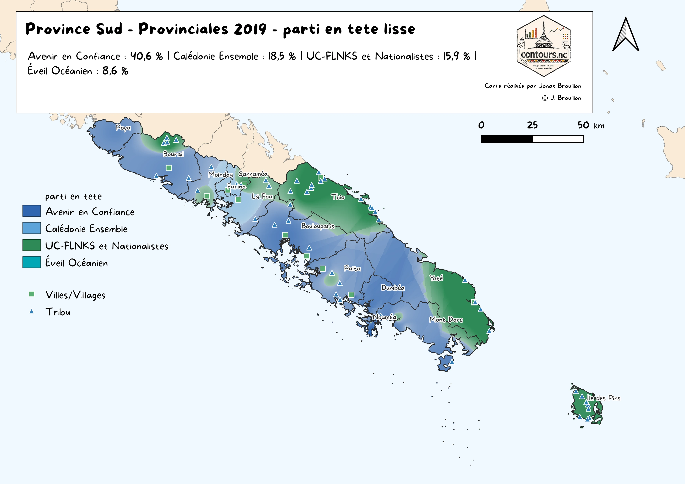
    </a>
    <div class="viz-gallery-card__body">
      <span class="viz-gallery-card__meta">Province Sud · carte statique</span>
      <h3><a href="../data/cartes/provinciales_2019_focus/province/province_sud_parti_en_tete_lisse_opacite_marge_moderee.webp">Listes en tête en Province Sud en 2019</a></h3>
      <p>Carte lissée des rapports de force électoraux à l'échelle provinciale.</p>
      <div class="viz-gallery-card__tags">
        <span class="viz-gallery-tag">carte statique</span>
        <span class="viz-gallery-tag">analyse électorale</span>
      </div>
      <div class="viz-gallery-card__actions">
        <a class="viz-gallery-card__link" href="../data/cartes/provinciales_2019_focus/province/province_sud_parti_en_tete_lisse_opacite_marge_moderee.webp">Ouvrir la carte</a>
        <a class="viz-gallery-card__secondary" href="../posts/provinciales-2019-geographies-electorales/">Lire l'analyse</a>
      </div>
    </div>
  </article>

  <article class="viz-gallery-card">
    <a class="viz-gallery-card__image" href="../data/cartes/provinciales_2019_focus/province/province_nord_parti_en_tete_lisse_opacite_marge_moderee.webp">
      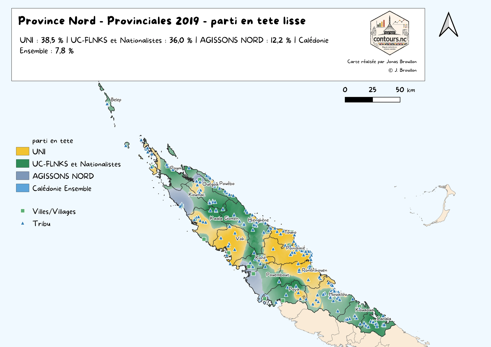
    </a>
    <div class="viz-gallery-card__body">
      <span class="viz-gallery-card__meta">Province Nord · carte statique</span>
      <h3><a href="../data/cartes/provinciales_2019_focus/province/province_nord_parti_en_tete_lisse_opacite_marge_moderee.webp">Listes en tête en Province Nord en 2019</a></h3>
      <p>Carte lissée des dominantes électorales dans les communes et espaces de la Province Nord.</p>
      <div class="viz-gallery-card__tags">
        <span class="viz-gallery-tag">carte statique</span>
        <span class="viz-gallery-tag">analyse électorale</span>
      </div>
      <div class="viz-gallery-card__actions">
        <a class="viz-gallery-card__link" href="../data/cartes/provinciales_2019_focus/province/province_nord_parti_en_tete_lisse_opacite_marge_moderee.webp">Ouvrir la carte</a>
        <a class="viz-gallery-card__secondary" href="../posts/provinciales-2019-geographies-electorales/">Lire l'analyse</a>
      </div>
    </div>
  </article>
</section>
```
