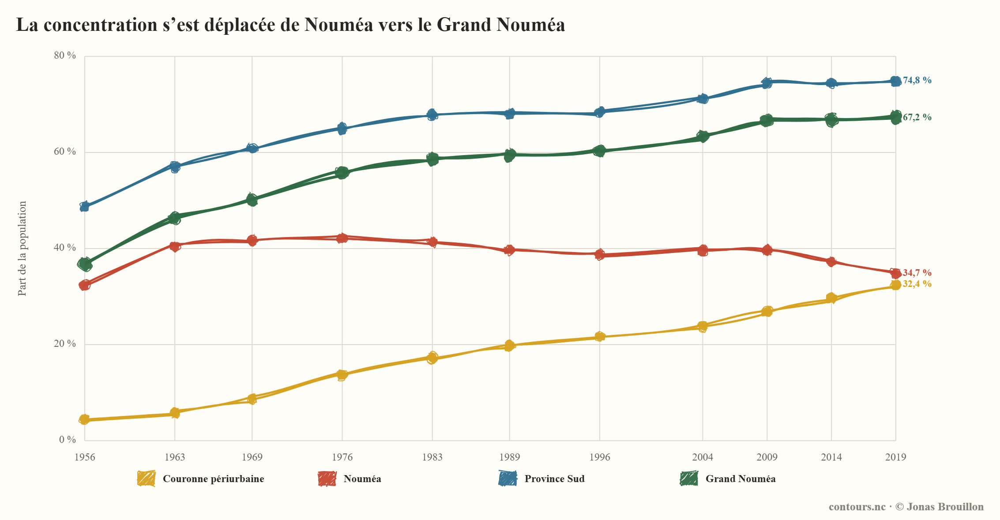
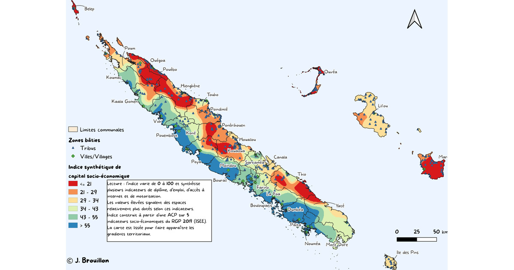

::: {#contours-section-demographie-societe .contours-section-sketch}
:::

```{=html}
<script type="module">
  import { renderContoursSectionBanner } from "../../assets/js/contours-sketch.js";

  renderContoursSectionBanner("#contours-section-demographie-societe", {
    sectionTitle: "Démographie et société"
  }).catch((error) => {
    console.error("[contours-section] La banniere n'a pas pu etre affichee.", error);
  });
</script>
```

```{=html}
<style>
.dossier-hero__image--contain {
  background: #fffdf8;
}

.dossier-hero__image--contain img {
  object-fit: contain;
}
</style>
```

```{=html}
<section class="dossier-hero">
  <div class="dossier-hero__body">
    <p class="dossier-kicker">Dossier éditorial</p>
    <h1>Démographie et société</h1>
    <p class="dossier-lede">Ce dossier rassemble les articles de contours.nc sur la population, les territoires et les contrastes sociaux en Nouvelle-Calédonie.</p>
    <p>On y suit des phénomènes concrets : où vivent les habitants, comment les espaces urbains se transforment, où se concentrent les emplois et les services, et comment les inégalités sociales se lisent dans l’espace.</p>
  </div>
  <div class="dossier-hero__image dossier-hero__image--contain">
    
  </div>
</section>

<section class="dossier-intro">
  <p>L’ordre proposé commence par les grandes dynamiques de peuplement, puis descend vers les contrastes socio-économiques observés à une échelle plus fine.</p>
</section>

<section class="dossier-grid" aria-label="Articles du dossier Démographie et société">
  <article class="dossier-card">
    <a class="dossier-card__image" href="../../posts/concentration-population-noumea-pacifique/">
      
    </a>
    <div class="dossier-card__body">
      <span class="dossier-card__phase">Peuplement et mobilités</span>
      <h3><a href="../../posts/concentration-population-noumea-pacifique/">Pourquoi la population se concentre autour de Nouméa ?</a></h3>
      <p>Une lecture des recensements, des migrations, des emplois et des villes principales du Pacifique pour comprendre le poids du Grand Nouméa.</p>
      <div class="dossier-card__meta">
        <span class="dossier-tag">18 juillet 2026</span>
        <span class="dossier-tag">Démographie</span>
        <span class="dossier-tag">Grand Nouméa</span>
      </div>
      <a class="dossier-card__link" href="../../posts/concentration-population-noumea-pacifique/">Lire l’analyse</a>
    </div>
  </article>

  <article class="dossier-card">
    <a class="dossier-card__image" href="../../posts/capital-socio-economique-nouvelle-caledonie/">
      
    </a>
    <div class="dossier-card__body">
      <span class="dossier-card__phase">Inégalités territoriales</span>
      <h3><a href="../../posts/capital-socio-economique-nouvelle-caledonie/">Cartographier le capital socio-économique en Nouvelle-Calédonie</a></h3>
      <p>Une construction d’indice à l’échelle des IRIS pour lire les contrastes de diplôme, d’emploi, d’équipement et d’accès aux ressources.</p>
      <div class="dossier-card__meta">
        <span class="dossier-tag">29 mai 2026</span>
        <span class="dossier-tag">Inégalités</span>
        <span class="dossier-tag">Cartographie</span>
      </div>
      <a class="dossier-card__link" href="../../posts/capital-socio-economique-nouvelle-caledonie/">Lire l’analyse</a>
    </div>
  </article>

  <article class="dossier-card">
    <a class="dossier-card__image" href="../../posts/disparites-territoriales-nouvelle-caledonie/">
      
    </a>
    <div class="dossier-card__body">
      <span class="dossier-card__phase">Inégalités territoriales</span>
      <h3><a href="../../posts/disparites-territoriales-nouvelle-caledonie/">Explorer les disparités territoriales en Nouvelle-Calédonie</a></h3>
      <p>Six visualisations pour comparer les 162 IRIS du pays et 58 zones du Grand Nouméa, croiser jusqu’à vingt indicateurs et lire leurs corrélations.</p>
      <div class="dossier-card__meta">
        <span class="dossier-tag">16 août 2026</span>
        <span class="dossier-tag">Grand Nouméa</span>
        <span class="dossier-tag">Inégalités</span>
      </div>
      <a class="dossier-card__link" href="../../posts/disparites-territoriales-nouvelle-caledonie/">Ouvrir les explorateurs</a>
    </div>
  </article>
</section>
```
