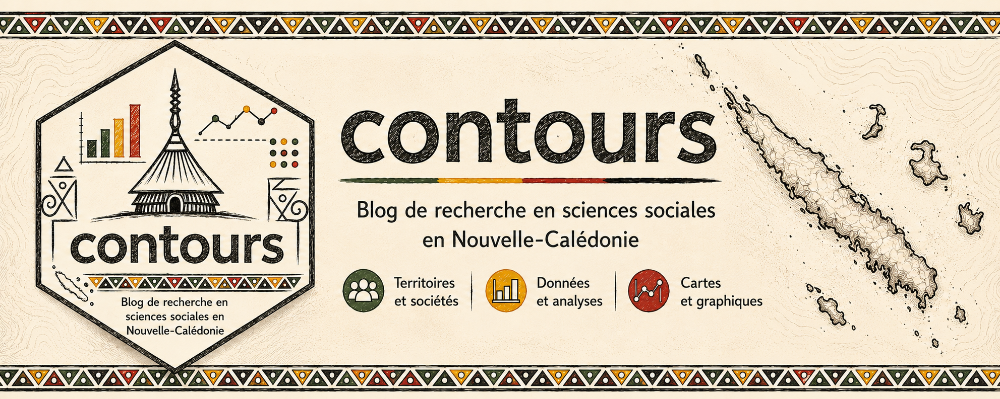

{.hero-banner}

contours est un carnet de recherche et de datavisualisation consacré à la Nouvelle-Calédonie : cartes, données publiques, sciences sociales, méthodes reproductibles et analyses spatiales.

Ce blog est crée et alimenté par  Jonas Brouillon, ingénieur d'études en sciences sociales.

## Derniers articles