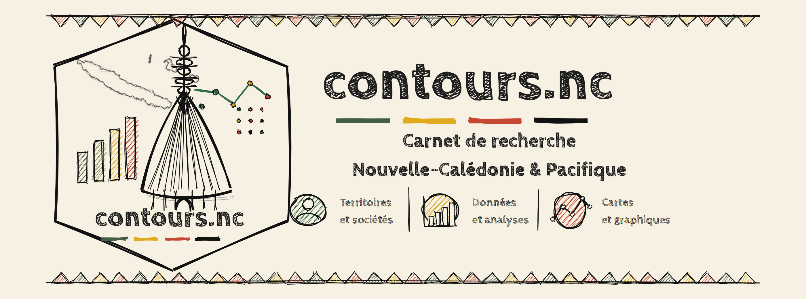

<div id="contours-sketch"></div>
<noscript>
  
</noscript>

<script type="module">
  import { renderContoursSketch } from "./assets/js/contours-sketch.js";

  renderContoursSketch("#contours-sketch").catch((error) => {
    console.error("[contours-sketch] La banniere n'a pas pu etre affichee.", error);
    document.querySelector("#contours-sketch").innerHTML =
      '';
  });
</script>

[contours]{.contours-word} est un carnet de recherche et de datavisualisation consacré à la Nouvelle-Calédonie : cartes, données publiques, sciences sociales, méthodes reproductibles et analyses spatiales.

Ce blog est créé et alimenté par [Jonas Brouillon]{.contours-word}, démographe calédonien et ingénieur d'études en sciences sociales.

## La dernière newsletter

```{=html}
<div class="quarto-listing quarto-listing-container-default latest-newsletter-listing">
  <div class="list quarto-listing-default">
    <div class="quarto-post image-right">
      <div class="thumbnail">
        <a href="newsletter/un-mois-de-contours-nc/">
          
        </a>
      </div>
      <div class="body">
        <h3 class="no-anchor listing-title">
          <a href="newsletter/un-mois-de-contours-nc/">Un mois de contours.nc</a>
        </h3>
        <div class="listing-subtitle">
          <a href="newsletter/un-mois-de-contours-nc/">Six analyses publiées, des relais dans les médias et la suite du projet</a>
        </div>
        <div class="listing-categories">
          <div class="listing-category">Newsletter</div>
        </div>
        <div class="delink listing-description">
          <a href="newsletter/un-mois-de-contours-nc/">
            <p>Première newsletter de contours.nc : six analyses publiées, des premiers relais dans le débat public et la suite du projet.</p>
          </a>
        </div>
      </div>
      <div class="metadata">
        <a href="newsletter/un-mois-de-contours-nc/">
          <div class="listing-date">27 juin 2026</div>
          <div class="listing-author">Jonas Brouillon</div>
        </a>
      </div>
    </div>
  </div>
</div>
```

## Derniers articles
