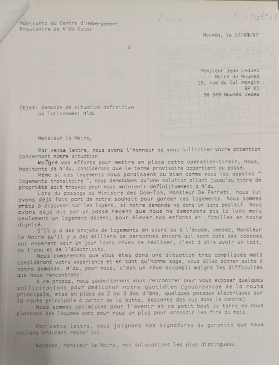

```{=html}
<link rel="stylesheet" href="../../assets/css/habitat.css">
<script src="../../assets/vendor/d3.v7.min.js"></script>
<script src="../../assets/vendor/rough.v4.js"></script>
<script
  id="habitat-map-bundle-data"
  type="application/json"
>

</script>
<script src="../../assets/js/disparites-territoriales-nouvelle-caledonie.js"></script>
```

::: habitat-lede
Dans les médias, la question des « squats » et des quartiers populaires à Nouméa est souvent traitée sous l’angle de la délinquance et des problèmes sociaux, stigmatisant toute ou partie d’une population. Cette approche, en focalisant sur les conséquences, masque les causes créatrices du mal-être profond habitant la ville coloniale de Nouméa. L'objectif de ce texte est de proposer des éléments de réflexion et d'analyse sur la problématique de l'habitat. Alors que les chiffres des recensements montrent une constante croissance urbaine depuis les années 1950, corrélée à une précarisation des habitants, la colonialité[^1] des pouvoirs publics doit aujourd'hui être questionnée. Nous souhaitons revenir ici sur 70 ans de « racisme spatial » ayant largement contribué à l’insurrection de mai 2024.
:::

[^1]: Philippe Colin, « Décolonialité — Critiques latino-américaines de la raison coloniale : vers une nouvelle écologie des savoirs », *Vocabulaire critique & spéculatif des transitions*, 17 décembre 2024, <https://vocabulairedestransitions.fr/article-44>, CC BY-NC-ND.

::: habitat-byline-note
**Texte et analyse historique : Franck Enjuanes.**

Traitement des recensements et visualisations : Jonas Brouillon.
:::

## À l’origine de ce texte

Ce dossier prend sa source dans des recherches d’archives et des séminaires menés autour du projet de recherche ANR-SITI[^2]. Il prolonge ce travail collectif, mais les analyses et les propositions réunies ici n’engagent que Franck Enjuanes. L’enjeu est de replacer la question du logement à Nouméa dans une histoire longue et d’en restituer la complexité, au-delà des récits centrés sur les faits divers. Ce texte n’est pas une publication scientifique : pour préserver la fluidité de la lecture, l’ensemble des références archivistiques n’y figure pas. Elles seront détaillées dans les livrables du projet et dans des publications scientifiques à venir.

[^2]: <https://anr.fr/Projet-ANR-22-CE55-0013>

## Une ségrégation spatiale constitutive de la logique de la ville

Nouméa, ville coloniale ! Avant la Seconde Guerre mondiale, il n’est pas facile de retracer l’histoire de l’habitat des travailleurs, et en particulier celui des Océaniens au sein de la ville. Il existait un camp pour les bagnards et les travailleurs kanak effectuant les travaux publics à Montravel. Durant les épisodes de peste du début du XXe siècle, le quartier proche de l’actuel Port Moselle, où dormaient les manœuvres océaniens et les canotiers travaillant dans le port, a été isolé du reste de la ville par une barrière de tôles. Dès sa construction, la Société des Hauts Fourneaux de Nouméa logeait ses travailleurs dans des baraquements à Doniambo, en séparant Javanais et Vietnamiens. En dehors de ces enclaves de travailleurs situées en marge des maisons bourgeoises, à proximité des sites industriels ou dans des zones d’activité commerciale nécessitant de la main-d’œuvre, les ouvriers et domestiques océaniens et asiatiques logeaient chez leurs « patrons », qui se devaient de leur fournir le toit et la nourriture, suivant les clauses des contrats d’engagement. Il était en principe interdit aux propriétaires de louer des chambres ou des habitations à des travailleurs indigènes. Cette règle était cependant régulièrement transgressée, comme en témoignent les rappels de l’administration à ce sujet.

Le couvre-feu imposé aux indigènes à la tombée de la nuit, la création de baraquements séparés par ethnie, l’interdiction de louer des chambres aux travailleurs ont organisé une ségrégation spatiale constitutive de la logique de la ville se développant autour du port de Nouméa. Cette pratique consistant à séparer, dans la mesure du possible, les colons des indigènes n’a pas disparu avec la fin du régime de l’indigénat en 1946. Au contraire, tout en prenant de nouvelles formes avec l’explosion démographique et urbaine des Trente Glorieuses, cette ségrégation spatiale reposant sur des critères économiques et raciaux est encore visible de nos jours.

## Le boom de la construction

Après la Seconde Guerre mondiale, la ville de Nouméa a connu un important boom de la construction. Son étude permet de comprendre comment l’empire colonial capitaliste français fait encore et toujours système depuis le début de la décolonisation.

Après la fin de l’indigénat, les anciens travailleurs engagés, kanak ou asiatiques, ont pu circuler, s’engager et se loger librement, ce qui les a encouragés à s’installer dans la ville de Nouméa. La prospérité de la ville a aussi attiré des migrants venus des territoires coloniaux ou ultramarins français — notamment d’Afrique et des Antilles — ainsi que de France hexagonale. Le Fonds d’investissement pour le développement économique et social des territoires d’outre-mer (FIDES)[^3] finance alors des infrastructures et des programmes de développement qui offrent de nouvelles possibilités de construction et d’investissement aux entrepreneurs et aux propriétaires. Des entreprises du bâtiment et des travaux publics sont alors venues se joindre aux maisons de commerce de Nouméa, jusque-là complètement maîtresses du jeu économique et politique de la colonie. Avec l’arrivée de ces fonds de développement, les multinationales françaises du secteur de la construction font leur entrée en Nouvelle-Calédonie.

[^3]: Institué par le décret n° 46-1633 du 5 juillet 1946, pris pour l’application de la loi du 30 avril 1946, le FIDES concourt au développement et à l’aménagement des territoires d’outre-mer par des aides à des programmes d’investissement ; voir le [décret du 4 août 1992 qui en rappelle le fondement et les missions](https://www.legifrance.gouv.fr/jorf/id/JORFTEXT000000359568).

Le boom de la construction démarre dans les années 1950 et prend de l’ampleur dans les années 1960. L’importation depuis la France de la plupart des matériaux de construction dynamise l’industrie hexagonale. Depuis, la ville de Nouméa et son agglomération se bétonisent et se coaltarent à marche forcée, malgré les crises politiques et les dépressions cycliques de l’industrie du nickel. À côté de l’importation de biens de grande consommation et de l’exportation de nickel, le secteur du BTP devient dès lors un secteur central de l’économie calédonienne. Il est dominé par un nombre restreint d’entreprises, affiliées de près ou de loin à des multinationales françaises, remportant l’essentiel des marchés publics locaux financés en grande partie par des transferts de fonds venus de France. Grâce à la [convention fiscale de 1983](https://juridoc.gouv.nc/juridoc/jdcodes.nsf/0/35380E76D07603384B257567007545B2/$File/Code-Impots-Annexe-13.pdf?OpenElement) et sous prétexte d’éviter la double imposition, les multinationales peuvent ainsi rapatrier en France une partie de la richesse créée localement.

## Une logique de propriétaires européens

Les institutions encadrant et dirigeant la politique de l’habitat à Nouméa ont été créées dans les années 1950, 1960 et 1970. Le Crédit de la Nouvelle-Calédonie voit le jour en 1956 et devient la Société immobilière et de crédit de la Nouvelle-Calédonie (SICNC) en 1963 ; sa scission donne naissance à la SIC et à la BCI en 1988.[^4] Le premier plan d’urbanisme date du début des années 1960. La SECAL est fondée au début des années 1970. Cette entreprise d’économie mixte adosse son travail à celui de la SCET[^5], à l’origine de la construction des grands ensembles en France à la même période. Pour l’État français et les pouvoirs publics locaux, il est question de loger les plus démunis avec des loyers aidés et de favoriser l’accès à la propriété, dans des bâtiments construits à la mode et avec des matériaux venus d’Europe.

[^4]: SIC, [« Notre histoire »](https://www.sic.nc/la-sic/).

[^5]: Créée en France en 1955, la SCET est aujourd’hui une filiale de la Caisse des dépôts et consignations et de l’Union sociale pour l’habitat ; voir le [site officiel de la SCET](https://www.scet.fr/).

Au début des années 1950, les discussions du Conseil général accompagnant les prémices de la construction se concentrent sur l’aspect financier du problème. Les conseillers généraux se demandent quels crédits et quels montages financiers permettront d’investir dans la construction de bâtiments et de lotissements. La rédaction du premier plan d’urbanisme, au début des années 1960, s’appuie sur une enquête de *commodo* et d’*incommodo* réalisée auprès de tous les propriétaires de Nouméa. Suivant la logique coloniale, les conditions de vie des Océaniens et la prise en compte de leur altérité restent des impensés des pouvoirs publics. Devant la montée en puissance des revendications kanak de terre dans les années 1970 et 1980, Nouméa s’accroche jalousement à la propriété foncière. Dans l’ordonnance n°82-880 du 15 octobre 1982[^6] organisant les commissions foncières municipales dans lesquelles des autorités coutumières servent de courroie de transmissions aux revendications de terres au sein même des communes, Nouméa est traitée à part. Le texte prévoit explicitement qu’aucune commission foncière municipale n’y soit créée. Nouméa est une ville de propriétaires Européens où l’unique terre kanak, ou du moins la seule administrativement reconnue comme telle, se situe sur la presqu’île de Nouville, depuis une revendication du clan Kamboa Boyi datant de janvier 1983. C’est donc selon une logique de propriétaire, de locataire, ou de logement social à bas loyer que la question de l’habitat a été pensée à Nouméa, sans prise en compte du rapport à la terre et aux modes d’habiter des Océaniens peuplant la ville.

[^6]: [Ordonnance n° 82-880 du 15 octobre 1982 relative à l’aménagement foncier, à l’établissement rural et à la reconnaissance des droits coutumiers sur le sol de la Nouvelle-Calédonie et dépendances — numérisation du *Journal officiel*](../../assets/documents/ordonnance-no-82-880-15-octobre-1982.pdf), art. 8, p. 3111 (p. 2 de la numérisation) ; voir aussi la [notice sur Légifrance](https://www.legifrance.gouv.fr/loda/id/LEGISCTA000006087807) et l’[ordonnance n° 85-1185 du 13 novembre 1985](https://www.legifrance.gouv.fr/loda/id/JORFTEXT000000521646/).

## Le cynisme de la catégorie « squat » en terre kanak

Face à la non-prise en compte des modes de vie océaniens, mais aussi pour des raisons économiques évidentes, de nombreux habitats « spontanés » sont apparus dans la ville. En toute objectivité, ce type d’habitat n’est pas facile à qualifier. Mais la catégorie « squat » choisie par les pouvoirs publics, politiquement très connotée, véhicule un cynisme insultant pour le peuple kanak au regard de l’Histoire.

Ce mode d’habitat, que j’appelle ici « spontané », n’est pas nouveau à Nouméa. Depuis le début de la colonisation, sur des terrains du Domaine ou privés, de nombreuses constructions en bois avec toit en paille, puis en tôles, sont apparues. Depuis la fin du XIXe siècle, le terme le plus courant utilisé dans les archives de l’administration pour désigner ces constructions est le mot « cabane », encore employé aujourd’hui. Le terme « taudis », moins descriptif et plus péjoratif, s’est ancré durablement dans le vocabulaire administratif à l’occasion de la réaction hygiéniste face aux épisodes de peste du début du XXe siècle. On l’utilise encore après la Seconde Guerre mondiale, lorsque commence le boom de la construction. Il est alors question de lutter contre les « taudis » pour « résorber l’habitat insalubre ». Cette dernière expression reste très utilisée par les pouvoirs publics qui, depuis les années 1990, luttent de manière volontariste et affichée contre les logements dits « insalubres » ou les « squats ». Ce dernier terme apparaît dans les années 1980, une chronologie qui montre d’emblée son origine politique. Alors qu’il est question de revendications de terre partout sur la Grande Terre, à Nouméa cette expression insiste sur le caractère illégal des occupations de terrains par les Kanak. Elle retourne la spoliation foncière coloniale originelle pour faire des Kanak les occupants illégaux des terres qui leur ont été prises 130 ans auparavant. Ce renversement constitue une contre-vérité historique et un triste exemple de la violence que peuvent renfermer les mots du colonisateur. C’est une insulte au peuple premier pour qui la terre n’est pas seulement un bien immobilier.

### Ce que le recensement appelle « squats »

En 2019, l'ISEE dénombre environ 1 100 ménages et 3 850 habitants permanents dans une cinquantaine de zones d’habitat spontané du Grand Nouméa. C’est 36 % de moins qu’en 2004, mais encore 2 % de la population de l’agglomération. Environ 2 350 de ces habitants résident dans la commune de Nouméa, 1 250 à Dumbéa et 250 au Mont-Dore. La synthèse de l’Isee indique que 97 % se déclarent océaniens ou métissés, dont 72 % Kanak, 11 % Wallisiens-Futuniens et 10 % métis ; les quatre points restants de cet ensemble ne sont pas détaillés.

<p class="habitat-source">

Source : Isee, <a href="https://www.isee.nc/component/phocadownload/category/267-logement-deplacements?download=2046%3Arp-2019-logements-equipements-les-conditions-de-logement-en-nouvelle-caledonie-en-2019">« Les conditions de logement en Nouvelle-Calédonie en 2019 »</a>, Synthèse n° 53, 2023.

</p>

## La politique de l’habitat relancée après les accords de Matignon-Oudinot

Le boom de la construction qui a fait suite à la Seconde Guerre mondiale reposait sur une logique de propriétaires, soutenue par des crédits et des motivations financières. La politique de l’habitat connaît un renouveau à la suite des accords de Matignon-Oudinot, quand apparaissent les contrats de ville, puis les contrats d’agglomération. Ceux-ci ont pour objectif d’organiser la ville selon une logique fragmentaire et utilitaire, à partir de moyens conséquents alloués par la France. Cette nouvelle politique de l’habitat va particulièrement s’atteler à la résorption de l’habitat dit « insalubre » ou « précaire » pour favoriser des logements collectifs financés par des crédits d’État. Dans les rapports du FSH ou de la SIC, on dénombre annuellement les logements sociaux et les bénéficiaires aidés. Cette politique du chiffre n’est cependant pas en adéquation avec les attentes et les problématiques des populations concernées.

La politique de l’habitat a donc connu une relance à la suite des accords de Matignon-Oudinot, mais ses fondements économiques et culturels n’ont pas changé. Nouméa reste pensée et vécue comme une ville coloniale, intégrée à la mondialisation où la « modernité » occidentale s’impose toujours brutalement. Les pouvoirs publics en charge de la politique de l’habitat — la province Sud, la mairie, l’État — repoussent dans les marges, dans l’illégalité ou dans l’informalité, pour reprendre les termes de la pensée dominante, des pratiques et des aspirations reposant sur l’altérité. De ce fait, les pouvoirs publics font délibérément le choix de placer des populations, démunies financièrement, dans un environnement monétarisé. Ils leurs imposent un mode de vie bétonné et artificialisé, éloignant ces populations de leur culture intimement liée à la terre.

## Violence matérielle et symbolique des pouvoirs publics

Parcourir les archives concernant le logement, le délogement et le relogement des populations à Nouméa n’est pas une partie de plaisir pour le chercheur. À travers la documentation produite par l’administration, on entrevoit les violences matérielles et symboliques faites aux populations par les pouvoirs publics. Deux exemples sont particulièrement éclairants à ce sujet : le délogement d’habitants à Tina au début des années 2000 et les conséquences de la destruction de l’habitat spontané de Kaméré au milieu des années 1990.

### À Tina des chevaux à la place des « squatteurs » ?

En 2001, le déploiement de la RT 14 en face de l’aérodrome de Magenta engage la municipalité de Nouméa à trouver un nouveau terrain pour le centre équestre de la Gourmette, dont les installations se trouvent affectées par les travaux projetés. Le choix se porte sur le terrain situé sur la droite de la route de Tina golfe, en face de l’entrée des Boucles. Le site est habité par une vingtaine de familles vivant dans une quinzaine de cabanes. Les premiers occupants se sont installés là, après avoir été délogés au moment de la création du golf de Tina.

Le 18 mai 2001 est ratifiée une première ordonnance d’expulsion du « chef et de tout occupant ». Les familles sont alors surveillées par la Police municipale, car le terrain est revendiqué par deux de habitants détenteurs d’une légitimité coutumière. Malgré la surveillance, les constructions de cabanes se poursuivent et l’arrivée des familles s’accélère.

En octobre 2004, lors d’une réunion Etat-ville, le recours à la force publique est sollicité par la mairie, afin de détruire les nouvelles constructions, sans résultat. En mars 2005, la municipalité sollicite de nouveau le haut-commissaire pour « sécuriser » les lieux avec le concours des forces de l’ordre et des travailleurs sociaux. Il s’agit de désarmer les habitants, de bloquer l’accès du terrain, de mettre en place un clôture et de démonter les cabanes en cours de construction.

Malgré la menace de l’utilisation de la force, il semble que la municipalité n’est pas atteint l’objectif escompté. En septembre 2005, de nouvelles discussions s’engagent avec les gérants du centre équestre de la Gourmette au sujet d’un bail visant à agrandir le terrain déjà existant. Début 2005, la mairie dénombre environ 76 familles installées sur le terrain municipal de Tina

Les chevaux n’ont donc pas remplacé les « squatteurs » à Tina, mais de manière rétrospective, cette tentative renseigne sur le respect accordé aux populations kanak et wallisiennes concernées. La violence symbolique du pouvoir colonial s’est exprimée par la surveillance et par la négation de la légitimité d’une population à habiter un espace, alors qu’elle venait déjà d’être délogée pour installer un golf.

Ce triste épisode, est le témoin d’un combat de fond qui se joue pour l’accès à la terre à Nouméa. Situé à proximité et sur la route d’un quartier huppé, cet habitat spontané est gênant. Par opposition, la résistance et la détermination des populations s’est manifestée par l’arrivée nombreuses de familles, même si ce mouvement traduit aussi les difficultés de logements que ces personnes rencontrent.

::: column-page
```{=html}
<div
  id="habitat-carte-tina"
  class="habitat-sketch habitat-map no-lightbox"
  data-sketch-chart="Deux cartes colorées de Nouméa mettant en évidence le quartier de Tina en 2019."
></div>
<script id="habitat-carte-tina-data" type="application/json">
{
  "options": {
    "type": "rough-map",
    "title": "Tina dans la géographie sociale de Nouméa",
    "metrics": ["taux_langue", "taux_cadres"],
    "defaultLeft": "taux_langue",
    "defaultRight": "taux_cadres",
    "defaultYear": 2019,
    "defaultView": "noumea",
    "showControls": false,
    "mobileFit": true,
    "focusMapId": "GN23",
    "focusLabel": "Tina",
    "aria_label": "Deux cartes interactives de Nouméa mettant en évidence Tina et comparant la connaissance d’une langue kanak à la part des cadres et professions intermédiaires en 2019."
  }
}
</script>
```

<p class="habitat-caption">

Tina est entouré et nommé en noir. Les pourcentages et les effectifs apparaissent au survol ou au clavier.

</p>
:::

### À Ducos, le non-respect de la volonté des populations

Sur la presqu’île de Ducos, même constat. Les pouvoirs publics ont choisi de détruire le squat de Kaméré en 1995. Malgré plusieurs demandes des populations, la décision a été maintenue et les habitants ont été délogés *manu militari*. Une partie d’entre eux, dont de nombreux Wallisiens, a été relogée au Centre d’hébergement provisoire (CHP) de N’Du, dans des logements de la municipalité gérés à travers une convention avec la SIC. Ces logements constituaient, dans l’esprit de la municipalité, une solution transitoire, d’où la décision de ne pas installer l’électricité dans le CHP. Les travaux sur les maisons étaient aussi interdits. Le gestionnaire de la SIC surveillait les entrées de bois destiné à la construction de terrasses et l’usage des groupes électrogènes ; il bloquait les camions de terre et de schiste que faisaient venir les habitants pour améliorer les routes et construire des plateformes en vue d’agrandissements. Cette volonté de l’administration de contrôler la vie des personnes constitue une nouvelle preuve flagrante du maintien de la colonialité des pouvoirs publics en ville.

Un projet de relogement collectif des habitants du CHP N’Du prévoyait de déplacer les populations dans des logements sociaux à Marconi, de l’autre côté de Ducos. Les habitants ont envoyé une pétition au maire en 1997 pour demander l’autorisation de s’installer définitivement dans leurs logements du CHP. La municipalité a dépêché la responsable de secteur de la Cellule du contrat de ville pour convaincre les habitants et négocier leur relogement. À aucun moment, la possibilité de les laisser s’installer chez eux n’a été évoquée.

{#fig-petition-chp-ndu width="72%"}

<p class="habitat-source">

Source : document d’archives fourni par l’auteur.

</p>

## Quel est le coût de la politique de logements sociaux ?

Il serait aujourd’hui intéressant d’avoir des données sur le coût de la politique de logements sociaux pour la collectivité, mais aussi pour les familles qui en bénéficient. Pour réfléchir à la question, repartons de l’exemple de Kaméré. Les familles vivant dans l’ancien « squat » avaient construit leurs maisons dans un endroit où la terre était disponible pour les cultures et à proximité de la mer, où elles pouvaient pêcher. Dans les logements dont elles sont devenues locataires, les charges se sont multipliées et les surfaces de culture ont quasiment disparu, tout comme la possibilité de cuisiner au feu de bois. Financièrement, malgré des loyers modérés, la vie n’est-elle pas plus chère dans les logements sociaux que dans les « squats ». N’est pas aussi moins en adéquation avec les habitudes de vie à l’extérieur, les pratiques agricoles et les systèmes de relations privilégiés par les Océaniens qui les habitent en majorité ?

De même, pour les collectivités, la politique de logements sociaux semble avoir un coût élevé. Il faut compter les frais d’études préalables et d’architecte ; les achats de terrains aux propriétaires privés et les frais de notaire ; la maîtrise d’œuvre pour la construction de bâtiments réalisés avec des matériaux souvent importés. Ces bâtiments se dégradent parfois vite, car ils sont construits à l’économie et avec des normes inadaptées au climat tropical. La collectivité doit ensuite supporter le coût de l’entretien et le panorama peu harmonieux offert par un habitat délabré. Le mode de vie en appartement entraîne aussi un surplus de dépenses énergétiques, sans parler des coûts engendrés par la destruction des liens sociaux. Enfin, la gestion des logements sociaux entraîne des dépenses administratives importantes, tout en dépossédant les locataires de leur emprise sur leur propre habitat.

Les logements sociaux peuvent être considérés comme une solution de secours ou d’urgence pour des familles en difficulté. En faire, un système d’habitat pérenne pour toute une population nous paraît difficile, critiquable, voire dangereux. Il est temps de se poser la question des coûts financiers, sociaux et énergétiques de cette politique.

## Quelques pistes de réflexion

Comment éviter ces violences symboliques et matérielles faites aux populations ? Comment prendre en compte leur volonté ? Comment faire des économies et concentrer l’aide et l’investissement dans des domaines prioritaires, comme l’éducation ou la santé, tout en offrant un cadre de vie plus sain, plus harmonieux, plus océanien, plus respectueux du paysage et de l’environnement ? Comment laisser les populations s’organiser elles-mêmes et assurer leurs propres besoins individuels et collectifs en s’appuyant sur les relations existantes, ou susceptibles de se créer par sentiment de responsabilité citoyenne et collective ?

Peut-être faudrait-il arrêter de construire de grands ensembles et privilégier l’habitat spontané sur des terrains où le foncier serait sécurisé. Peut-être faut-il céder la terre à ceux qui l’habitent par nécessité, par choix et pour longtemps, et qui ne désirent pas en faire un usage spéculatif. Peut-être les pouvoirs publics peuvent-ils apporter l’eau, l’électricité et un projet d’assainissement grâce aux finances publiques, tout en laissant les populations des quartiers gérer elles-mêmes l’entretien et en s’assurant que les installations restent sécurisées et salubres. Peut-être faudrait-il sortir de la logique coloniale qui enferme les populations dans un mode de vie et dans des cadres qui leur ont été imposés et ne leur correspondent pas. Peut-être pourrait-on faire autrement que parquer les gens entre quatre murs de béton ?

## À propos de l’auteur

::: habitat-bio
**Franck Enjuanes** est docteur en histoire contemporaine depuis décembre 2024. Ses travaux concernent l’histoire économique coloniale calédonienne. Il a consacré sa thèse à l’économie de comptoir et poursuit des recherches autour de différentes thématiques historiques du pays, en gardant à l’esprit leurs enjeux matériels et économiques. Chercheur indépendant, sans rattachement administratif ou scientifique à ce jour, il propose à Contours des textes documentés par des recherches en archives et adossés à des travaux scientifiques appelés à faire l’objet de publications plus approfondies.
:::

## À lire aussi

```{=html}
<section class="article-related">
<div class="article-related-grid">
  <a class="article-related-link" href="../concentration-population-noumea-pacifique/">
    <span class="article-related-kicker">Grand Nouméa</span>
    <span class="article-related-title">Pourquoi la population se concentre autour de Nouméa ?</span>
    <span class="article-related-note">Les dynamiques démographiques, les migrations et les emplois qui forment le cadre métropolitain de cette histoire du logement.</span>
  </a>
  <a class="article-related-link" href="../capital-socio-economique-nouvelle-caledonie/">
    <span class="article-related-kicker">Inégalités territoriales</span>
    <span class="article-related-title">Cartographier le capital socio-économique en Nouvelle-Calédonie</span>
    <span class="article-related-note">Une lecture à l’échelle des IRIS des contrastes sociaux et résidentiels qui structurent le territoire.</span>
  </a>
  <a class="article-related-link" href="../regroupement-bureaux-vote-noumea/">
    <span class="article-related-kicker">Accessibilité</span>
    <span class="article-related-title">Quel est l’effet du regroupement des bureaux de vote sur les temps de trajet à Nouméa ?</span>
    <span class="article-related-note">Comment l’organisation de la ville différencie aussi les conditions concrètes d’accès au vote selon les quartiers.</span>
  </a>
</div>
</section>
```